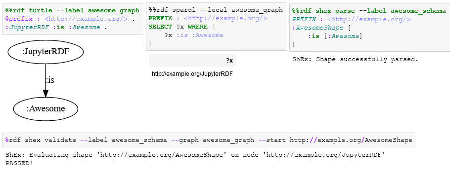

# Jupyter-RDFify
[](https://pypi.org/project/jupyter-rdfify/)
  
IPython Extension for semantic web technology support (Turtle, SPARQL, ShEx, etc.)

This extension is meant to be used together with Jupyter Notebooks for educational purposes. Its focus is neither performance nor scalability but instead ease-of-use.

# Teaching Semantic Web Technologies with Jupyter-RDFify

Jupyter-RDFify was developed by the [Chair of Information Systems at RWTH Aachen University](http://dbis.rwth-aachen.de/) to support interactive teaching of Semantic Web Technologies. You can find an examplary set of tutorial-like Jupyter Notebooks using Jupyter-RDFify at https://github.com/SemWebNotebooks/Notebooks/tree/main/Notebooks and further information on how to teach Semantic Web Technologies with Jupyter Notebooks, Jupyter-RDFify, the Moodle elearning system and automatic grading at https://github.com/SemWebNotebooks/Notebooks.

# Information concerning rdflib-jsonld warning

`DeprecationWarning: The rdflib-jsonld package has been integrated into rdflib as of rdflib==6.0.0.  Please remove rdflib-jsonld from your project's dependencies.`

You may get this deprecation warning when loading the extension. This is the fault of SPARQLWrapper which jupyter-rdfify depends on. It will stop appearing as soon as SPARQLWrapper removes json-ld from its dependencies. You can safely ignore this warning.

# Installation

## Install using Pip

```
python -m pip install jupyter-rdfify
```

## Install from Source using Pip

```
python -m pip install git+https://github.com/SemWebNotebooks/Jupyter-RDFify
```

## Dependencies

You will need to have [Graphviz](https://graphviz.org/) installed and added to your path.

If you're using Anaconda, you can install the Graphviz binaries using conda:

```
conda install -c conda-forge graphviz
```

# Usage

## Basic Usage

You first need to use the predefined `%load_ext` or `%reload_ext` magic to load Jupyter-RDFify. You need to do this each time your kernel is restarted.

```
%load_ext jupyter-rdfify
```

If you've installed the extension correctly, this should register the `%rdf` magic. This magic is special in that it is interpreted like a command line interface. If at any point you're wondering what arguments there are and what they do, do not hesitate to use the --help or -h flag.

To list all submodules:

```
%rdf --help
```

To list all arguments of the Turtle submodule:

```
%rdf turtle --help
```

# Submodules

Jupyter-RDFify is split into several submodules. Select the submodule you want using `%rdf <submodule>`

## Graph Serialization Submodules

These submodules allow you to parse and then visualize or convert graphs. The following graph serialization modules are provided by default: turtle, n3, json-ld, xml

### Visualization

To parse and visualize a graph, just use the `%%rdf` cell magic with the right submodule. For example to visualize a graph in Turtle notation:

```turtle
%%rdf turtle
@prefix : <http://example.org/> .
:JupyterRDF :is :Awesome .
```

If this throws an error you probably do not have Graphviz installed. If you do not want to use the visualization, just use `--display none` or `--display table`.

### Conversion

To parse and convert a graph into a different format, use a combination of `--display raw` and `--serialize <format>`. Possible formats are: turtle, n3, json-ld, xml

To convert a graph in Turtle notation to JSON-LD notation:

```turtle
%%rdf turtle --display raw --serialize json-ld
@prefix : <http://example.org/> .
:JupyterRDF :is :Awesome .
```

### Labelling

After parsing a graph, you may want to give it a label. You can later use this label to reference your graph in other submodules. With this you can for instance query, validate, draw or entail your graph later on. To give your graph a label just use the ```--label <label>``` or ```-l <label>``` argument.

```turtle
%%rdf turtle --label awesome_graph
@prefix : <http://example.org/> .
:JupyterRDF :is :Awesome .
```

The special label ```last``` will always hold the last object, even if no ```--label``` argument was supplied.

## SPARQL Submodule

You can use the SPARQL submodule to query existing endpoints or to query local graphs.

### Query SPARQL Endpoints

Use the ```--endpoint``` argument to query an endpoint. An example using the [Wikidata](https://www.wikidata.org) endpoint:

```sparql
%%rdf sparql --endpoint https://query.wikidata.org/sparql
SELECT ?item ?itemLabel 
WHERE 
{
  ?item wdt:P31 wd:Q146.
  SERVICE wikibase:label { bd:serviceParam wikibase:language "[AUTO_LANGUAGE],en". }
} LIMIT 10
```

### Query Local Graphs

You can query [labelled](#Labelling) graphs using the ```--local <label>``` argument. Note that this overrides the endpoint argument.

Example querying the above labelled graph:

```turtle
%%rdf sparql --local awesome_graph
PREFIX : <http://example.org/>
SELECT ?x WHERE {
    ?x :is :Awesome
}
```

## ShEx Submodule

With this submodule, you can validate graphs using the [ShEx](https://shex.io/) language. You first need to parse a schema:

```shex
%%rdf shex parse --label awesome_schema
PREFIX : <http://example.org/>
:AwesomeShape {
    :is [:Awesome]
}
```

We already gave the schema a [label](#Labelling) to reference it later. Note that graph labels and schema labels use different namespaces and do not overwrite each other.

To validate a graph, we need to provide the schema label (```--label```), the graph label (```--graph```) of the graph we want to validate against the schema and at least a starting shape (```--start```). This will check every node of the graph against the starting shape. If we want to focus on a specific node in the graph, we can use the ```--focus``` argument. To validate the ```awesome_graph``` against the ```awesome_schema```, starting from the ```:AwesomeShape``` and focussing on the ```:JupyterRDF``` node:

```
%rdf shex validate --label awesome_schema --graph awesome_graph --start http://example.org/AwesomeShape --focus http://example.org/JupyterRDF
```

## Other Features

### Prefixes
As many of the languages/formats use prefix declarations and these usually just distract from the actual task, most submodules lets you outsource them. Using either the ```--prefix``` flag or the ```prefix``` action (only for ShEx submodule), you can define a string which gets prepend to every cell magic of that submodule. A simple example for Turtle which defines some very frequent prefixes:

```turtle
%rdf turtle --prefix
@prefix rdf: <http://www.w3.org/1999/02/22-rdf-syntax-ns#> .
@prefix rdfs: <http://www.w3.org/2000/01/rdf-schema#> .
@prefix xsd: <http://www.w3.org/2001/XMLSchema#> .
```

### Graph Manager
The graph manager submodule lets you list, draw, entail and delete labelled graphs. You just need to specify the action and usually a graph label. To draw or ```awesome_graph```:

```
%rdf graph draw --label awesome_graph
```

### Entailment

Using [OWL-RL](https://owl-rl.readthedocs.io/en/latest/), you can generate the finite closure of a graph under either RDFS semantics, OWL-RL semantics or both. This uses a brute-force approach, so it may easily take a long time or fail for large graphs. You can either entail a parsed graph directly using the ```--entail <regime>``` argument or entail a labelled graph later using the graph manager:

```
%rdf graph entail-<regime> --label awesome_graph
```

For now you can only entail graphs in-place. Possible values for &lt;regime&gt;: rdfs, owl, rdfs+owl

# Dependencies

Note that these dependencies will be installed automatically if you use Pip.

[RDFLib](https://rdflib.readthedocs.io/en/stable/): The heart of this extension  
[RDFLib-jsonld](https://github.com/RDFLib/rdflib-jsonld): Extension of RDFLib for JSON-LD  
[SPARQLWrapper](https://github.com/RDFLib/sparqlwrapper): Extension of RDFLib for SPARQL  
[OWL-RL](https://owl-rl.readthedocs.io/en/latest/): Library for RDFS and OWL-RL entailment  
[PyShEx](https://github.com/hsolbrig/PyShEx): Implementation of ShEx  
[Graphviz python wrapper](https://pypi.org/project/graphviz/)  
[IPython](https://ipython.org/)
